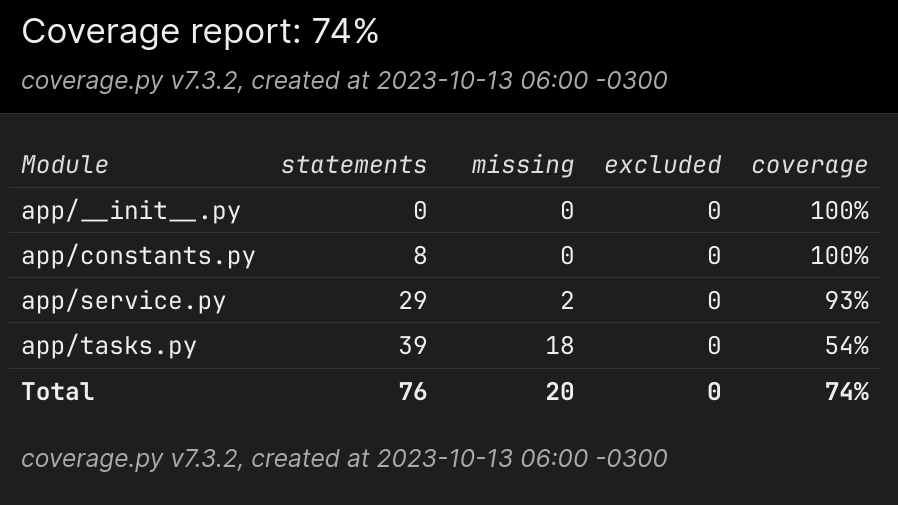

# devgrid-pychallenge
Implementation of the Python dev test provided by DevGrid.

This repo contains the source code used to implement the tech challenge delivered by DevGrid. It contains a web service that is able to collect data from OpenWeather API and stores it in JSON format.

I've decided to keep this implementation as simple as possible so as to address the most part of the issued test requirements, since the suggested web service does not have great complexity.

One can assume that the greatest challenge of this test is that there is a limit for fetching data from the OpenWeather API, so bulk requests must be handled properly to prevent performance loss and to leverage application scalability.

To tackle this problem, this application implements the basic concept of *task queues* to handle requests asyncronously. It makes use of the abstraction provided by [Celery](https://docs.celeryq.dev/en/stable/getting-started/introduction.html) to leverage the concept. For the web service implementation, I use [FastAPI](https://fastapi.tiangolo.com) since it is simple but powerful enough to deliver a good implementation of the solution. Regarding the concept of the *broker* present in the task queue implementation, I've decided to use [Redis](https://redis.io) to keep the data handling process simple. 

## Requirements
 - [Python 3.11+](https://www.python.org/downloads/release/python-3110)
 - [Poetry](https://python-poetry.org)
 - [Redis](https://redis.io)

## How to run it

Once you have cloned the repository and have requirement set up, you can run

`poetry install`

to install the application dependencies. Make sure you have every environment variable at `.env` set up. Also make sure you have Redis correctly set up and that its instance is listening to connections at port `6379`.

Then, to get celery up and running, run the following:

`poetry run celery -A app.tasks worker --loglevel=INFO`

Finally, in another terminal instance, to run the FastAPI web application you can execute the following command to get the service running:

`poetry run uvicorn app.service:app --host 0.0.0.0 --port 8000 --reload`


## Endpoints

FastAPI automatically provides a OpenAPI interface that you can easily verify the functionality of the application. There's an automatic redirect set up, so head over to `http://localhost:8000` in order to try it out.

### `POST /weather`
Request payload
```
{
    'user_id': 1234
}
```

### `GET /weather/{user_id}`

## Tests

You can run automated tests and generate coverage reports by running

`poetry run pytest -vv --cov=app --cov-report=html:tests/htmlcov tests`

The coverage report can be found at `tests/htmlcov/index.html`.

### Test Coverage Current Status



## Docker

- [✅] Dockerfile
- [✅] Redis Stage
- [✅] Celery Stage
- [✅] FastAPI Stage
- [❌] Solve I/O Volume Issue
- [❌] Integrate testing pipeline to Docker Compose
- [❌] Full Containerized Application
